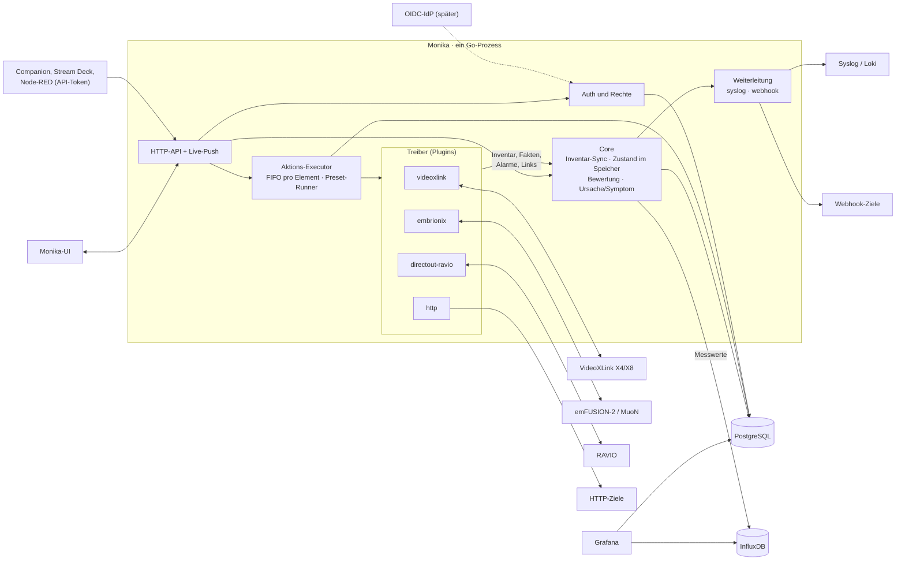
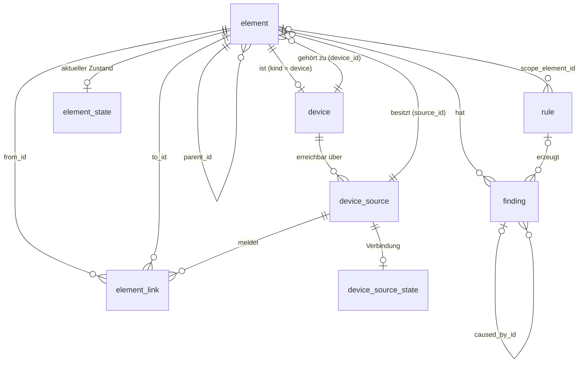
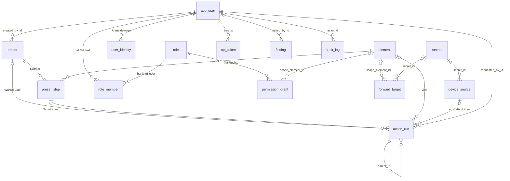

# Monika – Architektur

**Stand:** 2026-10-07 · **Status:** verbindlich für alle folgenden Arbeiten
**Schema-Referenz:** [`schema/monika.dbml`](schema/monika.dbml) (PostgreSQL). Dieses Dokument erklärt das *Warum* und die Regeln; das DBML ist die exakte Definition der Tabellen.

---

## Inhalt

1. [Zweck und Abgrenzung](#1-zweck-und-abgrenzung)
2. [Grundprinzipien](#2-grundprinzipien)
3. [Technologie und Systemaufbau](#3-technologie-und-systemaufbau)
4. [Treiber (Plugins)](#4-treiber-plugins)
5. [Das Element-Modell](#5-das-element-modell)
6. [Links: Beziehungen zwischen Elementen](#6-links-beziehungen-zwischen-elementen)
7. [Remote-Geräte und Perspektiven](#7-remote-geräte-und-perspektiven)
8. [Zustand und Bewertung](#8-zustand-und-bewertung)
9. [Aktionen und Einstellungen](#9-aktionen-und-einstellungen)
10. [Presets](#10-presets)
11. [Generische Aktionen: der HTTP-Treiber](#11-generische-aktionen-der-http-treiber)
12. [Benutzer, Rollen und Rechte](#12-benutzer-rollen-und-rechte)
13. [Weiterleitung](#13-weiterleitung)
14. [Datenhaltung](#14-datenhaltung)
15. [Datenbank](#15-datenbank)
16. [Referenzbeispiel: VideoXLink X8 im REMI-Betrieb](#16-referenzbeispiel-videoxlink-x8-im-remi-betrieb)
17. [Offene Punkte](#17-offene-punkte)
18. [Glossar](#18-glossar)

---

## 1. Zweck und Abgrenzung

Monika ist ein **universeller, einfacher Konfigurator und Monitor für Broadcast-Geräte**. Sie zeigt den echten Zustand von Geräten, Streams und I/O unterschiedlicher Hersteller in einem einheitlichen Modell und erlaubt es, auf diesen Geräten Aktionen auszuführen.

Die erste Treiber-Generation:

1. **VideoXLink X4/X8** (Hauptgrund des Projekts; Library `goxlinkclient` vorhanden)
2. **Embrionix / Riedel** emFUSION-2 und MuoN
3. **DirectOut RAVIO**
4. **HTTP** für generische Aktionen

### Was Monika ist

- Ein normalisiertes **Live-Bild** der Geräte mit Struktur (Bäume, Gruppen, Perspektiven).
- Eine **Bewertung** dieses Bildes gegen vom User definierte Regeln, inklusive Unterscheidung von **Ursache und Symptom** über die Topologie.
- Ein Werkzeug für **einmalige Aktionen**: Befehle, Einstellungen, Presets.

### Was Monika nicht ist

| Nicht-Ziel | Begründung / wohin stattdessen |
|---|---|
| **Kreuzschiene** | Streams werden nicht miteinander verschaltet. Dafür gibt es fertige Lösungen. |
| **Soll-Ist-Abgleich der Konfiguration** | Das Gerät ist immer die Wahrheit, auch weil über Hersteller-Software geändert werden kann. |
| **Mischpult-Controller / Live-Regler** | Aktionen sind einmalige Befehle mit „Übernehmen“, keine Regler mit Live-Wirkung (keine Fader, keine Farbwert-Slider). |
| **Prometheus-Nachbau** | Keine Zeitreihen-Abfragen (`rate()`, `avg_over_time()`), keine Arithmetik in Regeln → **Grafana auf InfluxDB**. |
| **Alerting-Plattform** | Kein Routing, keine Eskalation, keine Bereitschaftspläne → Befunde werden per **Syslog/Webhook** weitergegeben. |
| **Standort- oder Produktionsverwaltung** | Standorte und Produktionen sind **Gruppen**. |

**Abgrenzungsregel für neue Features:** *Was ohne Wissen über Struktur und Topologie funktioniert, gehört nicht in Monika.*

---

## 2. Grundprinzipien

1. **Das Gerät ist immer die Wahrheit.** Monika speichert keine Soll-Konfiguration und gleicht nichts ab. Ob eine Aktion gewirkt hat, zeigt der beobachtete Gerätezustand.
2. **Kein Kreuzschienen-Tool.** Signalbeziehungen (`feeds`) werden beobachtet, nie geschaltet.
3. **Treiber melden Fakten, der Core bewertet.** Kein Treiber entscheidet, was „OK“ ist (Ausnahme: Alarme, die das Gerät selbst meldet).
4. **Komposition statt Hierarchie.** Es gibt keine Gerätetypen wie „Gateway“ oder „Router“. Ein Gerät ist ein Baum aus generischen Elementen.
5. **Jedes Element hat genau einen Besitzer** (eine Quelle oder den User). Dasselbe reale Ding darf aus mehreren Perspektiven auftauchen; die Perspektiven sind über `represents` verbunden.
6. **Klare Besitzverhältnisse pro Spalte.** Treiber schreiben Treiber-Spalten, der User schreibt User-Spalten. Ein Re-Discovery überschreibt nie Labels, Notizen oder Gruppen.
7. **Spaltenregel:** Was übergreifend abgefragt wird, bekommt eine Spalte. Was nur angezeigt wird, kommt ins JSONB.
8. **Inventar, Zustand und Historie werden getrennt** (selten / ständig / wächst endlos).
9. **Vokabular lebt in Go.** `kind`, `transport`, Fakt-Schlüssel und Aktionsnamen sind kontrollierte Listen im Code, in der Datenbank `text`. Neue Werte brauchen keine Migration.
10. **Unbekannt ist nicht Fehler.** Fehlen aktuelle Daten, ist der Zustand `unknown`, nie ein eingefrorenes Grün und nie ein falsches Rot.

---

## 3. Technologie und Systemaufbau

| Bereich | Entscheidung |
|---|---|
| Sprache | **Go** |
| Architektur | **Monolith**: ein Prozess, ein Deployment |
| Erweiterbarkeit | **Plugin-getrieben nach dem Telegraf-Modell**: Treiber implementieren die Interfaces des Cores und werden **zur Compile-Zeit** eingebunden |
| Hauptdatenbank | **PostgreSQL ≥ 18** (wegen nativem `uuidv7()`) |
| Historie | **InfluxDB** |
| Auswertung der Historie | **Grafana** (bestehend), liest InfluxDB und löst Namen über PostgreSQL auf |
| IDs | **UUIDv7**, Typ `uuid` (nie `text`), im Normalfall in Go erzeugt (`uuid.NewV7()`) |
| Anmeldung | lokal; **OIDC** ist vorbereitet und kommt später |
| Geheimnisse | **verschlüsselter Secret-Store in PostgreSQL** (AES-256-GCM); Master-Key aus der Umgebung bzw. `.env` |
| Bootstrap | Master-Key, DB-Verbindung, InfluxDB-Token, initialer Admin aus der Umgebung bzw. `.env` |
| Hauptadressat | die **Monika-UI**; Push nach außen nur per Syslog und Webhook |

### Komponenten



### Datenfluss: Beobachten

```
Treiber ──Inventar, Fakten, Alarme, Links──▶ Core
                                              ├─ 1. Inventar synchronisieren   → element, element_link (nur eigene Quelle)
                                              ├─ 2. Fakten übernehmen          → element_state (nur bei Änderung)
                                              │                                → InfluxDB (jeder Wert)
                                              ├─ 3. Befunde erzeugen/aufheben  Regeln · Gerätealarme · System
                                              ├─ 4. Ursache vs. Symptom        über feeds / uses / parent
                                              ├─ 5. Health und Rollup          Element, Gerät, Gruppe
                                              └─ 6. Push                       UI (live), Weiterleitung (gefiltert)
```

Der Core hält Inventar, Zustand und Link-Graph **im Speicher** und bewertet dort. PostgreSQL dient der Persistenz (Neustart, SQL-Abfragen, Historie von Befunden und Läufen), nicht der Bewertungslogik.

### Datenfluss: Handeln

```
UI / API ──▶ Rechteprüfung ──▶ action_run (pending)
                                   │  FIFO pro Element
                                   ▼
                               Treiber (über die Quelle, die das Element besitzt)
                                   │
                    ┌──────────────┼───────────────┐
                    ▼              ▼               ▼
                 rejected        failed         accepted
                                                   │  Prüfbedingung gegen Fakten
                                          ┌────────┴────────┐
                                          ▼                 ▼
                                      confirmed        unconfirmed
```

---

## 4. Treiber (Plugins)

Pro Hersteller bzw. Gerätetyp gibt es einen Treiber. Treiber laufen im Monika-Prozess und implementieren die Treiber-Interfaces des Cores.

### Einbindung (Telegraf-Modell)

- Jeder Treiber liegt in einem eigenen Paket (`monika/drivers/<name>`) und registriert sich in `init()` beim Core (Name, Fabrikfunktion, Konfigurationsschema, Aktionsdefinitionen).
- Ein Sammelpaket (`monika/drivers/all`) importiert alle Treiber per Blank-Import; `main` importiert das Sammelpaket. Ein neuer Treiber = ein neues Paket plus eine Import-Zeile.
- Ergebnis ist **ein Binary**, typsicher, ohne Laden zur Laufzeit.
- **Abhängigkeitsrichtung:** Treiber importieren ausschließlich das öffentliche Paket `sdk/` (Interfaces, Vokabular, Registry) und ihre Gerätelibrary, nie `internal/`. Die Ordnerstruktur steht im `README.md` im Projektstamm.
- Optional: Build-Tags pro Treiber für schlanke Builds.
- **Treiber sind dünne Adapter.** Gerätelibraries (z. B. `goxlinkclient`) bleiben eigenständige Repositories ohne Abhängigkeit zu Monika; der Treiber übersetzt nur zwischen Library und Monika-Interfaces.
- **Fehlerisolation:** Jede Treiber-Goroutine läuft hinter einer `recover()`-Grenze. Ein Panic wird zum Befund `source.unreachable` mit Fehlermeldung und Neustart der Quelle, nicht zum Absturz von Monika.

Verworfen: Go `plugin` (`.so`; fragil bei Versionen und Abhängigkeiten), separate Prozesse per gRPC (widerspricht dem Monolithen; Isolation wird über `recover()` erreicht), WASM (für netzwerklastige Treiber nicht ausgereift).

### Pflichten eines Treibers

| Bereich | Pflicht |
|---|---|
| **Discovery** | Meldet den Elementbaum des Geräts: `kind`, `transport`, `direction`, `name`, `attributes`, Position. |
| **Identität** | Jedes Element hat eine **stabile `external_id`** (Slot-/Index-Pfad oder geräteeigene ID, nie eine laufende Nummer aus der Discovery-Reihenfolge). Wo vorhanden, zusätzlich eine global eindeutige `global_ref` (XLink-UnitID, NMOS-UUID). |
| **Fakten** | Meldet Zustandswerte als flache Map mit Punkt-Schlüsseln aus dem Go-Vokabular. Keine Bewertung. |
| **Alarme** | Reicht vom Gerät selbst gemeldete Alarme weiter. |
| **Links** | Meldet `feeds`, `uses` und `represents`. Ein Link über Gerätegrenzen wird von der Seite gemeldet, die ihn konfiguriert (bei XLink: der Decoder). |
| **Fähigkeiten** | Meldet pro Element die unterstützten Befehle (`actions`) und die schreibbaren Einstellungen (`settings`) mit Typ, Grenzen und ggf. `critical`. |
| **Ausführung** | Führt Befehle und `set` aus und liefert die Antwort des Geräts (inkl. abgelehnter Felder). |
| **Aktionsdefinitionen** | Bringt pro Befehl in Go mit: Parameter-Schema, Prüfbedingung mit Timeout, Kennzeichen `critical`. |
| **Konfigurationsschema** | Bringt ein JSON-Schema für seine `device_source.config` mit; die UI erzeugt daraus das Formular. |

### Verbote

- Ein Treiber fasst **nur Elemente und Links seiner eigenen Quelle** an.
- Ein Treiber bietet **keine Aktion an, die `feeds`-Links erzeugt oder ändert** (z. B. XLink `DecoderSender`). `uses`-Links dürfen geändert werden (z. B. Uplink-Interface eines Decoders).
- Ein Treiber bewertet nicht. Er meldet `signal_present: false`, nicht „Fehler“.
- Zugangsdaten stehen nie in `config`, sondern werden über `secret_id` aus dem Secret-Store bezogen. Der Core entschlüsselt und übergibt dem Treiber den Klartext.

### Vokabular in drei Stufen

Für Fakten und Aktionen gilt dasselbe Muster:

| Stufe | Fakten | Aktionen | Verwendung |
|---|---|---|---|
| **Kern** (einheitliche Bedeutung) | `reachable`, `running`, `signal_present`, `connected`, `format.*` | `start`, `stop`, `reboot`, `set`, `trigger` | generische UI, Sammelaktionen, herstellerübergreifende Regeln |
| **Bekannt** (benannt, optional) | `bitrate`, `packet_loss`, `ptp_offset`, `crc_errors` | – | Regeln und Dashboards über Hersteller hinweg |
| **Roh** (mit Namespace) | `vxl.cpu_temp`, `emb.sfp_rx_power` | `vxl.reset_video_buffer`, `vxl.flush_audio` | Detailseite, InfluxDB |

Ein Rohwert wird zum bekannten Wert, sobald ein zweiter Treiber denselben Wert liefert. Zeitliche Ableitungen (z. B. Paketverlust pro Sekunde) berechnet der Treiber, nicht die Regel.

---

## 5. Das Element-Modell

Alles, was Monika kennt, ist ein **Element**: Geräte, Ports, Units, Streams, Interfaces, Peers, Trigger und Gruppen. Status, Labels, Regeln, Rechte und Aktionen hängen dadurch an einer einzigen Tabelle.

### Drei Klassen

| Klasse | `kind` | `device_id` | `parent_id` | `source_id` | `external_id` |
|---|---|---|---|---|---|
| **Gerät** | `device` | = eigene `id` | NULL | NULL | NULL |
| **Gruppe** | `group` | NULL | NULL | NULL | NULL |
| **Treiber-Element** | alle anderen | gesetzt | gesetzt | gesetzt | gesetzt |

Erzwungen durch `element_class_check`. Das Gerät gehört keiner Quelle, weil es mehrere Quellen haben kann (z. B. XLink-API und IPMI).

### `kind`-Vokabular

`device`, `group`, `module`, `port`, `network_interface`, `clock`, `sender`, `receiver`, `peer`, `tunnel`, `processing`, `sensor`, `trigger`

- **`kind` beschreibt die Rolle, `transport` den Weg** (`sdi`, `madi`, `analog`, `aes3`, `st2110-20`, `st2110-30`, `st2110-40`, `aes67`, `xlink`, `srt`, `ndi`, …). Ein Gateway ist kein Typ, sondern ein Gerät mit `port`/`sdi` und `sender`/`st2110-20`.
- **`direction`** (`in`, `out`, `bidir`) ist die *Fähigkeit* eines Anschlusses. Die *aktuelle* Richtung eines bidirektionalen Ports ist ein Fakt.
- **Units sind keine Ports.** Ein Encoder hängt direkt unter dem Gerät und *nutzt* einen Port über einen `uses`-Link, der sich ändern darf.

### Gerät und Quellen

- `device` ist eine 1:1-Erweiterung von `element` mit der Identität des Geräts (`vendor`, `model`, `serial`, `firmware`), gemeldet von einer Quelle.
- `device_source` beschreibt, **wie** ein Gerät erreicht wird: Treiber, Adresse, Konfiguration, Verweis auf ein Secret (`secret_id`). Ein Gerät kann mehrere Quellen haben, höchstens eine pro Treiber.
- Jede Quelle besitzt ihre eigenen Elemente und Links. Ein Re-Discovery fasst nur diese an.
- `device_source_state` hält den Verbindungszustand von Monika zur Quelle (getrennt, weil er sich ständig ändert).

### Lebenszyklus

- **Elemente werden nicht gelöscht, sondern verschwinden:** `present = false`. Kommt dasselbe Element mit derselben `external_id` zurück, sind Label, Notizen und Gruppen wieder da.
- **Vorab-Anlage:** Der User kann Treiber-Elemente anlegen, bevor der Treiber sie gesehen hat (`first_seen_at = NULL`, z. B. ein erwarteter Peer vor einer Produktion). Findet der Treiber das Element, übernimmt er die Zeile anhand der `external_id`.
- **Wiederverwendete IDs:** Manche Geräte vergeben gelöschte IDs neu (XLink-Units). Ein neues Element erbt dann Labels und Regeln des alten. Faustregel: **Labels und Regeln gehören an stabile Dinge** (Ports, Geräte, vor allem Gruppen).

### Besitz der Spalten

| Wer | Spalten |
|---|---|
| Treiber | `kind`, `transport`, `direction`, `name`, `attributes`, `position`, `external_id`, `global_ref`, `actions`, `settings` |
| Core | `present`, `first_seen_at`, `last_seen_at`, `device_id`, `source_id`, `parent_id` (aus der Discovery) |
| User | `label`, `notes`, `monitored` |

### Gruppen

- Gruppen sind Elemente (`kind = group`) und werden vom User angelegt.
- Hierarchie und Mitgliedschaft laufen **ausschließlich über `element_link` vom Typ `member`**, nie über `parent_id`. Damit sind sie n:m und beliebig verschachtelt.
- **Position und Label hängen an der Mitgliedschaft**, nicht am Element: Gerät B / Input 1 ist *in dieser Stagebox* Kanal 5.
- `member`-Links dürfen keine Zyklen bilden (Prüfung in der Anwendung per rekursiver Abfrage).
- Health einer Gruppe = schlimmster Zustand der Mitglieder, plus Rollup mit Zählern. **Keine Redundanzlogik:** Jeder Ausfall ist ein Fehler, auch wenn die Produktion weiterläuft.
- Standorte und Produktionen werden als Gruppen modelliert.

Beispiel: eine Stagebox mit 8 Eingängen aus zwei Geräten mit je 4 Eingängen.

```
Bühne (Gruppe)
└─ Stagebox links (Gruppe)
   ├─ #1 "Gesang"    → Gerät A / Input 1
   ├─ ...
   ├─ #5 "Keys L"    → Gerät B / Input 1
   └─ #8 "Bass DI"   → Gerät B / Input 4
```

---

## 6. Links: Beziehungen zwischen Elementen

Die physische Struktur steckt in `parent_id`. Alle anderen Beziehungen sind **Links** in `element_link`.

| Typ | Bedeutung | Gemeldet von | Wirkung bei Problemen |
|---|---|---|---|
| `feeds` | Signalfluss: A speist B (SDI-In → Encoder, Remote-E1 → D1) | Treiber | Problem an A → B betroffen |
| `uses` | Ressourcenbindung ohne Signalrichtung (Unit → Port, Stream → Interface, Decoder → Peer) | Treiber | Problem an B → A betroffen |
| `member` | Gruppenmitgliedschaft (Gruppe → Mitglied) | User | keine; Gruppen aggregieren |
| `represents` | Perspektive: A ist Stellvertreter von B (Peer → Remote-Gerät) | Treiber | keine |

Regeln:

- **Unaufgelöste Links:** Ist ein Endpunkt noch nicht in Monika, steht seine `global_ref` in `from_ref`/`to_ref`. Der Core löst den Link auf, sobald das Element bekannt ist.
- **Treiber-Links** werden bei Wegfall gelöscht (nicht weich markiert). Ihre Historie gehört ins Audit bzw. nach InfluxDB.
- `member`-Links haben keine Quelle, alle anderen genau eine (`element_link_owner_check`).
- **Kreuzschienen-Grenze:** Aktionen dürfen `uses`-Links verändern, niemals `feeds`-Links.

---

## 7. Remote-Geräte und Perspektiven

Bei XLink-Remote-Produktionen hängen entfernte Geräte an mehreren lokalen Geräten (Remote 1 schickt Kanal 1 an Lokal 1 und Kanal 2 an Lokal 2). Monika soll die Remote-Geräte nicht abfragen müssen (Management-Traffic), aber die Kernabhängigkeit sehen: Hat das lokale Gerät die Gegenstelle gefunden, ist sie verbunden, welche Kanäle laufen darüber?

**Lösung: Das lokale Gerät beschreibt seine Sicht auf die Gegenstelle, nicht die Gegenstelle selbst.**

```
L1  X8A1001
├─ Peer X8A9001          peer             Fakten: connected, rtt, p2p
│  └─ X8A9001-E1         sender · xlink   Stellvertreter: läuft, Signal am Remote-Eingang
├─ D1                    receiver · xlink   ◀──feeds── Peer X8A9001 / E1
│                                           ──uses───▶ Peer X8A9001
│                                           ──feeds──▶ SDI 5
└─ Peer X8A9002 …
```

- Unter dem Peer hängen **nur die Remote-Units, die mit diesem lokalen Gerät verbunden sind** (Hin- und Rückwege), keine Health-Daten des Remote-Geräts.
- Die Stellvertreter kommen aus der **lokalen Link-Konfiguration** (`Decoder.Sender`, `Encoder.Receiver`). Ist die Gegenstelle weg, bleiben Peer und Stellvertreter im Baum und werden als nicht verbunden bzw. unbekannt gemeldet.
- Jede lokale Verbindung hat ihren eigenen Peer (L1↔R1 und L2↔R1 sind zwei Verbindungen mit eigener RTT).
- **Wird das Remote-Gerät zusätzlich in Monika angelegt**, ist es ein normales Gerät mit eigener Quelle. Stellvertreter und Original werden über `represents` verbunden. Die UI kann dann am Remote-Gerät anzeigen, wer es repräsentiert, und Diskrepanzen (Gerät sagt „läuft“, Sicht von L1 sagt „nicht verbunden“) deuten auf die Strecke.
- **`global_ref` steht nur am Element im eigenen Baum**, nie an Stellvertretern.
- Aktionen an Stellvertretern laufen über die Quelle des lokalen Geräts (XLink kann Remote-Units über das lokale System steuern).

---

## 8. Zustand und Bewertung

### Fakten

`element_state.facts` ist eine **flache Map** aller aktuellen Werte mit Punkt-Schlüsseln, z. B. `{"running": true, "signal_present": true, "format.rate": 50, "vxl.cpu_temp": 61}`. Gerätegemeldete Alarme stehen getrennt in `alarms`.

### Regeln

Alle Regeln kommen vom User. Es gibt keine mitgelieferten Standardregeln.

**Eine Regel beschreibt den Sollzustand**, nicht den Fehler:

```
fact <op> value          [when when_fact <when_op> when_value]
```

| Bestandteil | Inhalt |
|---|---|
| `fact` | Fakt-Schlüssel, z. B. `running`, `format.rate`, `vxl.cpu_temp` |
| `op` | `eq`, `ne` (bool, Zahl, String) · `lt`, `lte`, `gt`, `gte` (Zahl) · `in`, `not_in` (Liste) |
| `value` | JSONB: `true`, `50`, `"i"`, `[50, 59.94]` |
| `when` | optionale Vorbedingung im selben Format |
| `hold_seconds` | Verletzung muss so lange anliegen, bevor ein Befund entsteht |
| `clear_value` | Hysterese, nur numerisch |
| `severity` | `info`, `warning`, `error` |
| Geltungsbereich | `scope_element_id` (Element, Gerät inkl. Kinder, Gruppe inkl. Mitglieder rekursiv) und/oder Filter `match_kind`, `match_transport`, `match_driver`; alles NULL = global |

Auswertung:

- **Fakt existiert am Element nicht** oder **`when` ist nicht erfüllt** → die Regel gilt dort nicht. Nur so funktionieren Gruppen- und globale Regeln.
- **Pro Element und Fakt gewinnt die spezifischste Regel:** Element > Gerät > Gruppe > global. Gleich spezifische Regeln gelten alle.
- `monitored = false` nimmt ein Element von allen Regeln aus.
- Operator und Werttyp werden in Go beim Speichern geprüft.

Beispiele:

| Bereich | Regel | Bedeutung |
|---|---|---|
| Gruppe „Kamera 3 REMI“ | `signal_present eq true` | alles in der Gruppe, was Signal melden kann, soll Signal haben |
| Peer-Element | `connected eq true` | Kernabhängigkeit einer Remote-Strecke |
| `match_driver = videoxlink` | `vxl.cpu_temp lte 80`, Hysterese `75` | Temperatur aller X8 |
| Ein bestimmtes X8 | `vxl.cpu_temp lte 85` | überschreibt die globale Regel für dieses Gerät |
| Encoder E1 | `signal_present eq true` **when** `running eq true` | Signal nur prüfen, wenn die Unit läuft |

### Befunde

Ein Element ist nicht einfach „rot“, sondern hat **Befunde** (`finding`). Herkünfte:

| `origin` | Entsteht durch | `code` |
|---|---|---|
| `rule` | verletzte Regel des Users | `rule.violated` |
| `device` | vom Gerät gemeldeten Alarm (automatisch) | Alarmcode des Geräts |
| `system` | Monika selbst | `source.unreachable`, `data.stale` |

- Höchstens **ein aktiver Befund pro Element, Code und Regel** (Teilindex `finding_active_uq`).
- **Quittieren** ändert nicht die Health, nur Anzeige und Meldung.
- Wird eine Regel gelöscht, bleiben ihre Befunde mit Regel-Snapshot in `details` erhalten (`rule_id` → NULL).

### Ursache und Symptom

Entsteht ein Befund, prüft der Core flussaufwärts entlang der Links, ob dort bereits ein Fehler aktiv ist. Wenn ja, wird der neue Befund als **Symptom** markiert (`caused_by_id`).

| Beziehung | Problem breitet sich aus … |
|---|---|
| `feeds` A → B | von A nach B |
| `uses` A → B | von B nach A |
| `parent` | vom Elternelement zu den Kindern |
| `member`, `represents` | gar nicht |

Ergebnis im REMI-Fall: „Peer X8A9001 getrennt“ ist **eine** Ursache mit „2 betroffen“ (D1, SDI 5) statt dreier roter Einzelalarme.

### Health

- **Health** = schlimmster aktiver Befund am Element (`ok`, `warning`, `error`, `unknown`). `info`-Befunde färben nicht.
- **Unbekannt statt Fehler:** Ist eine Quelle nicht erreichbar, bekommt das **Gerät** den Befund `source.unreachable`; alle Elemente darunter werden `unknown`. Sind Daten älter als etwa das Dreifache des Takts, wird das Element `unknown` (`data.stale`).
- **Rollup** für Geräte und Gruppen: `{"ok": 12, "warning": 1, "error": 0, "unknown": 3}`.

---

## 9. Aktionen und Einstellungen

### Grundsätze

- **Aktionen sind einmalige Befehle** mit „Übernehmen“, nie Regler mit Live-Wirkung.
- **Alles, was der Treiber an Konfiguration anbietet, ist ausführbar bzw. änderbar.**
- **Erfolg = beobachteter Gerätezustand**, nicht die Antwort auf den Befehl. *Angenommen ≠ bestätigt.*
- Eine Aktion läuft **immer über die Quelle, die das Element besitzt**.
- Läufe an einem Element werden vom Core **nacheinander abgearbeitet (FIFO)**; ein weiterer Lauf wartet als `pending`.

### Befehle

Unterstützte Befehle stehen pro Element in `element.actions` (z. B. `{start, stop, reboot, vxl.reset_video_buffer}`). Ob ein Befehl *gerade* sinnvoll ist (Start nur, wenn gestoppt), leitet die UI aus den Fakten ab.

### Einstellungen: schreibbare Fakten

- Die generische Aktion **`set`** ändert Einstellungen: `set {"bitrate": 20, "codec": "h265"}`.
- **Der Schlüssel einer Einstellung ist derselbe wie der des Fakts**, der ihren aktuellen Wert zeigt.
- Grenzen stehen in `element.settings`:

```json
{
  "bitrate":             { "type": "int",  "min": 1, "max": 100, "unit": "Mbps" },
  "codec":               { "type": "enum", "values": ["h264", "h265", "vc5"] },
  "video2110.interface": { "type": "enum", "values": ["eth6", "eth7"] },
  "eth0.ip":             { "type": "ipv4", "critical": true }
}
```

- **Prüfung automatisch:** Jeder gesetzte Schlüssel muss danach `eq` dem Wert sein.
- **Einzeln oder gemeinsam:** Die Detailseite setzt einzelne Parameter (`set` mit einem Schlüssel); Presets setzen mehrere.
- Lehnt das Gerät ab, enthält `response` die abgelehnten Felder (XLink: `DeviceError.Fields`), damit die UI das Feld markieren kann.
- Rundet ein Gerät einen Wert, endet der Lauf als `unconfirmed`.

### Lebenszyklus eines Laufs

| Status | Bedeutung |
|---|---|
| `pending` | angelegt, wartet (ggf. in der Warteschlange des Elements) |
| `sent` | an den Treiber übergeben |
| `rejected` | Gerät hat abgelehnt |
| `failed` | Gerät nicht erreicht / Transportfehler / Ziel nicht vorhanden |
| `accepted` | angenommen; Endzustand, wenn es keine Prüfbedingung gibt |
| `confirmed` | Prüfbedingung im Gerätezustand erfüllt |
| `unconfirmed` | Timeout: angenommen, aber keine Wirkung beobachtet (z. B. XLink-Decoder ohne freie Lizenz) |
| `cancelled` | abgebrochen |

Die Prüfbedingung kommt aus der Aktionsdefinition (z. B. `start` → `running eq true` in 10 s) bzw. bei `set` aus den gesetzten Werten. Sie wird als Snapshot in `action_run.verify` gespeichert.

### Sammelaktionen

Eine Aktion auf eine Gruppe oder ein Gerät wird auf alle Mitglieder verteilt, die sie unterstützen (bei `set`: die den Schlüssel haben). Es entsteht ein übergeordneter Lauf mit einem Kind-Lauf pro Element; der übergeordnete Lauf fasst zusammen („7 von 8 bestätigt“).

### Kritische Aktionen

- **Kritisch ist, was bei einem Fehlgriff viel kaputt macht und lange zur Behebung braucht** (Reboot, Management-IP), im Gegensatz zu schnell behebbaren Fehlgriffen (Stream neu starten, Bitrate).
- Der **Treiber** legt fest, was kritisch ist: Kennzeichen an der Aktionsdefinition bzw. `"critical": true` an einem Schlüssel in `element.settings`. Ein `set` ist kritisch, sobald ein gesetzter Schlüssel kritisch ist.
- `action_run.critical` friert ein, ob ein Lauf kritisch war.
- Rechte: siehe [Abschnitt 12](#12-benutzer-rollen-und-rechte).

### Audit

`action_run` ist zugleich das Audit-Log aller Aktionen: wer, was, wann, über welche Quelle, mit welchem Ergebnis.

---

## 10. Presets

Die meisten Geräte haben keine eigenen Presets. Produktionen brauchen aber z. B. andere Bandbreiten. Presets gehören deshalb zu Monika.

- **Ein Preset ist eine gespeicherte Befehlsfolge, kein Sollzustand.** Monika merkt sich, *was getan werden soll*, nicht *wie das Gerät aussehen soll*. Nach dem Ausführen wird nichts abgeglichen; ob alles stimmt, stellt der Operator fest. Soll ein Wert dauerhaft überwacht werden, legt der User ausdrücklich eine Regel an.
- Ein Preset besteht aus **Schritten in Stufen**:
  - Schritte derselben Stufe laufen **parallel**, Stufen **nacheinander**.
  - Jede Stufe wartet, bis alle Läufe der vorigen einen Endzustand erreicht haben.
  - **`delay_ms` pro Schritt:** Wartezeit ab Beginn der Stufe (ermöglicht Pausen zwischen Stufen und gestaffelte Starts innerhalb einer Stufe).
  - **`continue_on_error`:** Ohne dieses Kennzeichen bricht ein fehlgeschlagener Schritt das Preset ab.
- Ziel eines Schritts ist ein Element, Gerät oder eine Gruppe (Verteilung auf Mitglieder).
- Ausführung: Preset-Lauf → Schritt-Läufe → Element-Läufe, alles in `action_run` über `parent_id`.
- **Vorabprüfung der Rechte:** Vor dem Start prüft der Core für jeden Schritt das nötige Recht am Ziel (inkl. `critical`). Fehlt eines, startet das Preset nicht.
- Ziel-Elemente sind mit `ON DELETE RESTRICT` geschützt. Ist ein Ziel nur `present = false`, schlägt der Schritt beim Ausführen mit klarer Meldung fehl.

```
Preset „Produktion XY – 25 Mbit“
  Stufe 1                  Gruppe „REMI Encoder“   stop
  Stufe 2                  Gruppe „REMI Encoder“   set {"bitrate": 25, "codec": "h265"}
                           L1 / D2                 set {"video2110.interface": "eth7"}
  Stufe 3  delay 5000 ms   Gruppe „REMI Encoder“   start
```

---

## 11. Generische Aktionen: der HTTP-Treiber

Generische Aktionen (z. B. Webhooks auf Knopfdruck) sind **kein eigenes Konzept**, sondern ein Treiber.

- Ein externes System ist ein **Gerät mit Treiber `http`**. Jeder konfigurierte Aufruf wird ein **Element** (`kind = trigger`, `actions = {trigger}`).
- Damit funktionieren Labels, Gruppen, Presets, Rechte und Audit ohne Sonderfall.
- **Für diesen Treiber ist seine Konfiguration (`device_source.config`) das Gerät.**
- **Nur Sende-Aufrufe.** Monika liest keinen Zustand vom Zielsystem.

Konfiguration pro Aufruf:

```json
{
  "id": "tally",
  "name": "Tally Kamera",
  "method": "POST",
  "path": "/api/tally",
  "body": "{\"camera\": {{camera}}, \"state\": {{state}}}",
  "params": {
    "camera": { "type": "int",  "min": 1, "max": 16, "value": 3 },
    "state":  { "type": "enum", "values": ["off", "preview", "program"], "value": "off" }
  }
}
```

| Regel | |
|---|---|
| `id` | = `external_id`, vom User vergeben und stabil (kein Array-Index) |
| `body`, `path` | Vorlagen; werden von keiner Aktion verändert |
| Platzhalter | ohne Anführungszeichen; eingesetzt als JSON-Wert im Body bzw. URL-encodiert in Pfad und Query |
| `params` | werden zu `element.settings`; `params.*.value` wird als Fakt gemeldet |
| Bedeutung des Fakts | „Monika würde diesen Wert senden“, **nicht** Zustand des Zielsystems |
| `set` | ändert den gespeicherten Wert (`params.*.value`) |
| `trigger {…}` | Overrides nur für diesen Aufruf, gegen dieselben Grenzen geprüft; in Presets bevorzugt, weil atomar |
| Ergebnis | 2xx → `accepted` · 4xx/5xx → `rejected` (Status, Body in `response`) · Timeout/keine Verbindung → `failed` |
| Fakten pro Aufruf | `last_status`, `last_called_at`, `last_duration_ms` |
| Health-Check | optional pro Gerät (`path`, `interval_s`) → normale Erreichbarkeitslogik |
| Nebenläufigkeit | Alle Aufrufe einer Quelle teilen sich `config`: `set` aktualisiert nur den betroffenen Pfad (`jsonb_set`) bzw. wird pro Quelle serialisiert |
| Geheimnisse | nur über den Secret-Store (`secret_id` der Quelle) |

Später möglich: weitere Treiber nach demselben Muster (`osc`, `tcp`).

---

## 12. Benutzer, Rollen und Rechte

### Identität und Berechtigung sind getrennt

- **Identität** („Wer bist du?“): lokal mit Passwort oder später per **OIDC**. Externe Anmeldewege stehen in `user_identity` (Issuer + `sub`); kommt ein IdP dazu, entstehen nur neue Zeilen.
- **Berechtigung** („Was darfst du in Monika?“): immer in Monikas Datenbank, weil sie sich auf Monikas Objekte bezieht (Fremdschlüssel auf `element`, Audit auf `app_user`).
- Rollen können über `external_ref` an einen Wert im Groups-Claim des IdP gekoppelt werden; die Mitgliedschaft wird dann beim Login synchronisiert (`role_member.origin = 'idp'`).

### Rollen und Rechte

- Rechte werden an **Rollen** vergeben, nie direkt an Benutzer.
- **Nur Erlauben, kein Verbieten.** Rechte aus mehreren Rollen addieren sich.
- **Scope wie bei Regeln:** Gerät oder Gruppe (rekursiv), NULL = überall.

| Recht | Bereich | Bedeutung |
|---|---|---|
| `view` | Scope | sehen |
| `acknowledge` | Scope | Befunde quittieren |
| `operate` | Scope | Befehle (`start`, `stop`, `trigger`, …) |
| `configure` | Scope | Einstellungen (`set`) |
| `critical` | Scope | **Zusatzrecht** für kritische Befehle und Einstellungen |
| `inventory_edit` | Scope | Labels, Gruppen, Geräte und Quellen |
| `rule_edit` | Scope | Regeln |
| `preset_run` | global | Presets ausführen (plus Rechte an allen Zielen) |
| `preset_edit` | global | Presets bearbeiten |
| `admin` | global | Benutzer, Rollen, Rechte, Weiterleitungen |

**Kritische Aktionen** brauchen das Grundrecht **und** `critical` im selben Bereich:

| Aktion | benötigte Rechte |
|---|---|
| Stream stoppen | `operate` |
| Reboot | `operate` + `critical` |
| Bitrate ändern | `configure` |
| Management-IP ändern | `configure` + `critical` |

### Maschinen

Externe Systeme (Companion, Stream Deck, Node-RED) nutzen **Dienstkonten** (`app_user.is_service`) mit **API-Tokens** (`api_token`, gespeichert als SHA-256-Hash, Klartext nur einmal bei Erstellung sichtbar). Rechte und Audit funktionieren wie bei Menschen.

### Audit

- **Benutzer werden nie gelöscht**, nur deaktiviert. Alle Audit-Verweise bleiben gültig.
- `action_run` protokolliert Aktionen, `audit_log` alle anderen Änderungen (Regeln, Presets, Quellen, Rollen, Rechte, Weiterleitungen, Anmeldungen), mit Vorher/Nachher und geschwärzten Geheimnissen.

---

## 13. Weiterleitung

- **Die Monika-UI ist der Hauptadressat.** Push nach außen ist für den Fall gedacht, dass niemand hinschaut.
- Arten: **`syslog`** (in den zentralen Syslog-Stack; Monika-Ereignisse liegen dann in Loki neben den Gerätelogs) und **`webhook`** (Body-Vorlage wie beim HTTP-Treiber; deckt Slack, Teams und Mail über Node-RED ab).
- Ereignisse: `finding.raised`, `finding.cleared`, `finding.acked`, `action.finished`.
- Filter: Ereignistyp, Mindest-Schweregrad, Scope-Element.
- **Best effort:** wenige Wiederholungen im Speicher, danach `last_error`. Kein Routing, keine Eskalation, keine Outbox.

---

## 14. Datenhaltung

| Daten | Ort | Schreibverhalten |
|---|---|---|
| Inventar (Elemente, Geräte, Quellen, Links) | PostgreSQL | bei Discovery-Änderungen |
| Aktueller Zustand, Health, Rollup | PostgreSQL `element_state` | **nur bei Änderung** |
| Befunde (aktiv und Historie) | PostgreSQL `finding` | bei Statuswechsel |
| Regeln, Presets, Rechte, Weiterleitungen | PostgreSQL | bei Änderung durch den User |
| Läufe und Audit | PostgreSQL `action_run`, `audit_log` | pro Ereignis |
| Messwerte, Signal, Health als Zahl | **InfluxDB** | jeder Takt |
| Arbeitszustand der Bewertung | Speicher des Core | ständig |

### InfluxDB

- Tags: `element_id`, `device_id`, `kind`, `transport`, `driver`.
- **Nie Labels als Tags**: Labels ändern sich, eine Umbenennung würde Zeitreihen zerreißen. Grafana löst Namen über PostgreSQL auf.

### PostgreSQL-Konventionen

- IDs: `uuid` mit UUIDv7 (zeitlich sortiert, gut für B-Tree-Inserts). Go erzeugt IDs vor dem Insert, damit ganze Discovery-Bäume in einem Batch geschrieben werden können.
- Enums nur für kleine, stabile Mengen (`link_type`, `health`, `severity`, `rule_op`, `action_status`, `finding_origin`, `permission`, `forward_kind`, `port_direction`).
- Herstellerspezifisches in JSONB (`attributes`, `config`, `facts`, `settings`).
- Zugangsdaten nie in JSONB, sondern verschlüsselt im Secret-Store.

### Secret-Store

Muster wie bei Grafana (`secret_key`) oder n8n (`N8N_ENCRYPTION_KEY`): Zugangsdaten liegen **verschlüsselt in PostgreSQL**, der Schlüssel liegt **außerhalb der Datenbank**.

- **Benannte Secrets** in der Tabelle `secret`, z. B. `xlink-admin`. Viele Quellen verweisen per Fremdschlüssel (`secret_id`) auf dasselbe Secret; ein Passwortwechsel betrifft alle sofort.
- **Gleiche Datenbank wie Monika.** Die Sicherheit kommt aus der Verschlüsselung, nicht aus der Trennung; nur in derselben Datenbank funktionieren die Fremdschlüssel.
- **Master-Key:** 32 zufällige Bytes, Base64, aus `MONIKA_MASTER_KEY` (Umgebung oder `.env`). Erzeugen mit `openssl rand -base64 32`. Ein zufälliger Schlüssel, kein Passwort, daher keine Schlüsselableitung nötig.
- **Verfahren:** AES-256-GCM aus der Go-Standardbibliothek. Pro Verschlüsselung eine zufällige 12-Byte-Nonce. Die `id` des Secrets ist Associated Data, damit verschlüsselte Werte nicht zwischen Zeilen vertauscht werden können.
- **Verschlüsselt und entschlüsselt wird nur in Go.** Kein `pgcrypto` mit Schlüssel im SQL (der Schlüssel würde in Logs und Statistiken landen).
- **Klartext ist JSON**, z. B. `{"username": "admin", "password": "…"}` oder `{"token": "…"}`. Das Format legt der jeweilige Treiber fest.
- **Schlüsselrotation:** Jede Zeile trägt die `key_id` des verwendeten Master-Keys. Für eine Rotation wird zusätzlich der alte Schlüssel angegeben (`MONIKA_MASTER_KEY_PREVIOUS`); beim Start verschlüsselt Monika alle Zeilen mit altem Schlüssel neu.
- **Startprüfung:** Kann Monika vorhandene Secrets mit dem angegebenen Schlüssel nicht entschlüsseln, startet sie nicht. So entstehen keine gemischt verschlüsselten Bestände.
- **Schlüssel verloren = Secrets verloren.** Die Zugangsdaten müssen dann neu eingegeben werden. Der Master-Key wird getrennt vom Datenbank-Backup gesichert; ein Datenbank-Backup allein ist für Angreifer wertlos.
- **Nur schreiben, nie lesen:** Die UI zeigt Name und Beschreibung, nie den Wert. Ein Secret kann nur ersetzt werden. Werte werden nie geloggt oder ins Audit geschrieben (`audit_log` vermerkt nur, *dass* sich ein Secret geändert hat).
- **Rechte:** Secrets anlegen, ersetzen und löschen erfordert `admin`. Ein Secret einer Quelle zuweisen erfordert `inventory_edit` (nur Auswahl per Name).
- Ein Secret, das noch verwendet wird, kann nicht gelöscht werden (`ON DELETE RESTRICT`).

### Bootstrap aus der Umgebung

Beim Start liest Monika aus Umgebungsvariablen bzw. einer `.env`-Datei (Variablen haben Vorrang; `.env` gehört nicht ins Git und hat Rechte `600`):

| Variable | Zweck |
|---|---|
| `MONIKA_MASTER_KEY` | Schlüssel des Secret-Stores |
| `MONIKA_MASTER_KEY_PREVIOUS` | nur während einer Rotation |
| `MONIKA_DATABASE_URL` | PostgreSQL-Verbindung |
| `MONIKA_INFLUX_URL`, `MONIKA_INFLUX_TOKEN` | InfluxDB |
| `MONIKA_ADMIN_USER`, `MONIKA_ADMIN_PASSWORD` | initialer Admin; wird nur angelegt, wenn noch kein Benutzer existiert |

Alles Weitere (Zugangsdaten der Geräte, Tokens für HTTP-Treiber und Webhooks, später das OIDC-Client-Secret) liegt im Secret-Store.

---

## 15. Datenbank

20 Tabellen in sieben Bereichen. Exakte Definition: `monika.dbml`.

| Bereich | Tabellen |
|---|---|
| Inventar | `element`, `device`, `device_source`, `element_link` |
| Zustand | `element_state`, `device_source_state` |
| Bewertung | `rule`, `finding` |
| Aktionen | `preset`, `preset_step`, `action_run` |
| Benutzer und Rechte | `app_user`, `user_identity`, `role`, `role_member`, `permission_grant`, `api_token`, `audit_log` |
| Weiterleitung | `forward_target` |
| Geheimnisse | `secret` |

### Inventar, Zustand und Bewertung



### Aktionen, Benutzer und Weiterleitung



### Constraints außerhalb von DBML

Diese Regeln stehen als SQL in den Tabellennotizen von `monika.dbml` und müssen in der Migration angelegt werden.

| Tabelle | Constraint | Zweck |
|---|---|---|
| `element` | `element_class_check` | Pflichtfelder je Klasse (Gerät, Gruppe, Treiber-Element) |
| `element_link` | `element_link_endpoints_check` | jeder Endpunkt als ID oder Referenz |
| `element_link` | `element_link_owner_check` | `member` ohne Quelle, alle anderen mit Quelle |
| `element_link` | `element_link_uq` (Ausdrucksindex) | keine doppelten Links, auch unaufgelöst |
| `rule` | `rule_when_check` | `when` vollständig oder gar nicht |
| `rule` | `rule_hold_check` | `hold_seconds >= 0` |
| `finding` | `finding_active_uq` (Teilindex) | ein aktiver Befund pro Element, Code und Regel |
| `preset_step` | `preset_step_check` | `stage >= 1`, `delay_ms >= 0` |
| `action_run` | `action_run_target_check` | Ziel-Element Pflicht außer am Preset-Wurzel-Lauf |
| `permission_grant` | `permission_grant_global_check` | `preset_run`, `preset_edit`, `admin` nur global |
| `permission_grant` | `permission_grant_uq` (Ausdrucksindex) | keine doppelten Rechte |

### Lösch-Verhalten

| Fremdschlüssel | Verhalten |
|---|---|
| `element_link.from_id`, `to_id` | `CASCADE` |
| `finding.rule_id` | `SET NULL` (Historie bleibt) |
| `preset_step.preset_id` | `CASCADE` |
| `preset_step.element_id` | `RESTRICT` (Presets verlieren keine Schritte stillschweigend) |
| `action_run.preset_id`, `preset_step_id` | `SET NULL` |
| `role_member.role_id`, `permission_grant.role_id` | `CASCADE` |
| `permission_grant.scope_element_id` | `CASCADE` |
| `device_source.secret_id`, `forward_target.secret_id` | `RESTRICT` (verwendete Secrets sind nicht löschbar) |
| Verweise auf `app_user` | Benutzer werden nie gelöscht |

---

## 16. Referenzbeispiel: VideoXLink X8 im REMI-Betrieb

Quelle der Daten: `goxlinkclient` (JSON-RPC des Web-Frontends; `System`-Snapshot bei jeder Änderung, `Stats` etwa alle 2 s).

```
X8A1111                device · VideoXLink X8 R2 · FW 1.8.4
├─ SDI 1–8             port · sdi · bidir
├─ eth0–eth7           network_interface        (eth6/7 2110-fähig)
├─ PTP                 clock
├─ E1                  sender · xlink        ──uses──▶  SDI 3
│                                            ──feeds─▶  X8A2222-D2   (anderes Gerät)
├─ D2                  receiver · xlink      ──feeds─▶  SDI 5
│  ├─ Video 2110       sender · st2110-20    ──uses──▶  eth6
│  └─ Audio 2110       sender · st2110-30    ──uses──▶  eth6
├─ srtE1               sender · srt
├─ NdiD1               receiver · ndi
├─ L2S1                tunnel                ──uses──▶  eth2
└─ Peer X8A9001        peer                  connected, rtt, p2p
   └─ X8A9001-E1       sender · xlink        Stellvertreter des Remote-Encoders
```

| Thema | Umsetzung |
|---|---|
| Fakten | `running`, `signal_present`, `format.*`, `bitrate`, `vxl.cpu_temp`, `vxl.licenses_used`, … |
| Gerätealarme | SRT-`Error` |
| Abgeleitete Alarme | über Regeln (PTP-Sync, Temperaturen, Lizenzen, `NeedsReboot`) |
| Befehle | `start`, `stop`, `vxl.reset_stats`, `vxl.reset_video_buffer`, `vxl.flush_audio` |
| Einstellungen | Bitrate, Codec, 2110-Interface und -Adressen, … |
| Ausgeschlossen | `DecoderSender` (ändert `feeds`) |
| Kritisch (Beispiel) | Reboot, Änderungen an Management-Interfaces |
| Fallstrick | Start vor Verbindungsaufbau oder ohne Decoder-Lizenz wird angenommen, wirkt aber nicht → `unconfirmed` |

---

## 17. Offene Punkte

Diese Punkte sind **nicht entschieden** und dürfen nicht als festgelegt angenommen werden.

| Thema | Stand |
|---|---|
| Treiber-Interfaces | konkrete Go-Interfaces des Cores (Einbindung ist entschieden: Compile-Zeit) |
| Betrieb / Hochverfügbarkeit | Zustand liegt im Speicher des Core; Verhalten bei mehreren Instanzen ist nicht festgelegt |
| Aufbewahrung | Retention für `finding`, `action_run`, `audit_log` und InfluxDB |
| InfluxDB-Details | Version, Measurement-Schema |
| Frontend | Technologie und Live-Push-Mechanismus |
| SQL-Migration | Übersetzung von `monika.dbml` inkl. aller Constraints und `ON DELETE`-Regeln |
| Spätere Erweiterungen | `osc`-/`tcp`-Treiber; Prüfbedingung, die auf ein anderes Element zeigt |

---

## 18. Glossar

| Begriff | Bedeutung |
|---|---|
| **Element** | Alles, was Monika kennt: Gerät, Port, Unit, Stream, Peer, Trigger, Gruppe |
| **Quelle** (`device_source`) | ein Zugangsweg zu einem Gerät über einen Treiber |
| **Treiber** | Plugin für einen Hersteller/Gerätetyp; meldet Inventar und Fakten, führt Aktionen aus |
| **Fakt** | ein aktueller Wert eines Elements, z. B. `running: true` |
| **Regel** | Sollzustand über einen Fakt, vom User definiert |
| **Befund** | aktive oder vergangene Abweichung an einem Element (aus Regel, Gerät oder System) |
| **Ursache / Symptom** | Befund ohne bzw. mit `caused_by_id` |
| **Stellvertreter** | Element, das ein anderes aus der Sicht eines Geräts darstellt (`represents`) |
| **Peer** | Sicht eines lokalen XLink-Geräts auf eine Gegenstelle |
| **Lauf** (`action_run`) | eine Ausführung einer Aktion, eines Schritts oder eines Presets |
| **Preset** | gespeicherte Befehlsfolge in Stufen, kein Sollzustand |
| **Kritisch** | Aktion oder Einstellung, deren Fehlgriff viel kaputt macht und lange zur Behebung braucht |
| **Rolle** | Benutzergruppe, an die Rechte vergeben werden |
| **Secret** | benannter, verschlüsselt gespeicherter geheimer Wert; Quellen verweisen per `secret_id` darauf |
| **Master-Key** | Schlüssel des Secret-Stores; liegt nur in der Umgebung bzw. `.env` |
